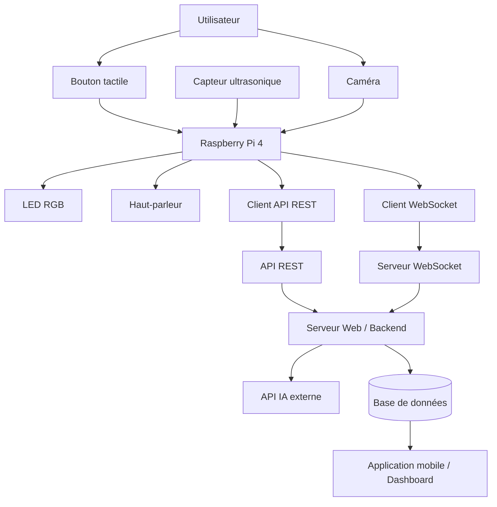

# Tricolo – Système IoT Intelligent de Triage des Déchets

##  Description du Projet

**Tricolo** est un système IoT intelligent basé sur **Raspberry Pi 4**, conçu pour assister les utilisateurs dans le tri des déchets grâce à des **indications visuelles (LED)**, **sonores (feedback vocal)** et à une **collecte de données centralisée** accessible via une application mobile.

Le système détecte une interaction utilisateur, analyse le contexte (présence / état du bac), fournit un retour immédiat et transmet les données à un serveur web pour affichage dans un tableau de bord.

Ce projet est réalisé dans un cadre **académique**, avec une architecture réaliste, modulaire et orientée IoT.

---

##  Objectifs du Projet

- Guider l’utilisateur vers le bon bac (recyclage, compost, déchets)
- Fournir un feedback clair et immédiat (LED + audio)
- Détecter si un bac est plein
- Envoyer les données vers un backend en temps réel
- Visualiser les statistiques dans une application mobile
- Réduire les erreurs de tri des déchets

---

##  Fonctionnalités Principales

| Fonction | Description |
|--------|------------|
| Interaction utilisateur | Bouton physique |
| Feedback visuel | LED RGB |
| Feedback vocal | Haut-parleur |
| Détection de niveau | Capteur ultrasonique |
| Communication réseau | WebSocket + REST |
| Collecte de données | Statistiques de tri |
| Dashboard | Application mobile |

---

##  Spécifications Techniques

###  Matériel Utilisé

| Composant | Quantité | Rôle |
|---------|----------|------|
| Raspberry Pi 4 (2GB ou +) | 1 | Unité centrale |
| LED RGB keystudios | 2 | Indication d’état et de bac |
| caméra pi | 1 | prendre en photo le déchet |
| Capteur ultrasonique (HC-SR04) | 1 | Détection bac plein |
| Bouton poussoir | 1 | Déclenchement utilisateur |
| Haut-parleur USB | 1 | Feedback vocal |
| Powerbank USB | 1 | Alimentation portable |
| Carte microSD (16 GB min) | 1 | OS + application |

---

###  Capacités du Raspberry Pi 4

| Ressource | Détails |
|---------|--------|
| CPU | Quad-core ARM Cortex-A72 |
| RAM | 2 GB ou plus |
| GPIO | 40 broches |
| Réseau | Wi-Fi + Ethernet |
| USB | USB 2.0 / 3.0 |
| Audio | HDMI / USB |

 Le Raspberry Pi 4 est largement suffisant pour ce projet.

---

##  Mapping GPIO (Configuration Recommandée)

| Composant | GPIO |
|---------|------|
| LED RGB #1 | GPIO 17 |
| LED RGB #2 | GPIO 27 |
| LED RGB #3 | GPIO 22 |
| LED RGB #4 | GPIO 23 |
| LED RGB #5 | GPIO 24 |
| Ultrasonic Trigger | GPIO 5 |
| Ultrasonic Echo | GPIO 6 |
| Bouton | GPIO 18 |
| Audio | USB (aucun GPIO) |

 Le signal **Echo** du capteur ultrasonique doit passer par un **diviseur de tension** (5V → 3.3V).

---

##  Logiciels Utilisés

| Logiciel | Rôle |
|--------|------|
| Raspberry Pi OS | Système d’exploitation |
| Python 3.9+ | Logique embarquée |
| RPi.GPIO | Gestion des GPIO |
| WebSocket | Communication temps réel |
| REST API | Backend |
| pyttsx3 | Synthèse vocale |
| PostgreSQL / SQLite | Stockage des données |

---


## 📐 Diagramme UML – Architecture du Système




---

##  Communication Pi ↔ Serveur

### Architecture retenue

| Type | Utilisation |
|----|------------|
| REST API | Envoi de données (scan, état bac) |
| WebSocket | Réponses en temps réel |
| Format | JSON |

### Exemple de message envoyé

```json
{
  "event": "waste_detected",
  "category": "recyclage",
  "timestamp": "2026-02-04T20:15:00"
}
```
## 📂 Structure du Projet

```text
Tricolo/
├── main.py                 # Point d’entrée du système embarqué
├── config.json             # Configuration GPIO, réseau et paramètres généraux
├── requirements.txt        # Dépendances Python
├── modules/
│   ├── gpio_manager.py     # Gestion centralisée des GPIO
│   ├── leds.py             # Contrôle des LED RGB (feedback visuel)
│   ├── sensors.py          # Capteur ultrasonique et bouton
│   ├── audio.py            # Feedback vocal (haut-parleur)
│   ├── websocket_client.py # Client WebSocket vers le backend
│   └── stats.py            # Envoi des statistiques et événements
├── backend/
│   ├── api.py              # API REST (réception des données du Raspberry Pi)
│   ├── websocket.py        # Serveur WebSocket (communication temps réel)
│   └── database.py         # Gestion de la base de données
└── tests/
    ├── test_gpio.py        # Tests des GPIO
    └── test_audio.py       # Tests audio
```

---

##  Utilisation

### Démarrage du système embarqué

```bash
python3 main.py
Tests individuels
python3 tests/test_gpio.py
python3 tests/test_audio.py
```
##  Limites du Projet
Reconnaissance limitée aux catégories définies

Nécessite une connexion réseau active

Prototype non destiné à un usage industriel ou commercial

##  Sécurité et Confidentialité
Aucune donnée personnelle stockée

Communications chiffrées via HTTPS / WSS

Données utilisées uniquement à des fins statistiques et pédagogiques

##  Roadmap
Ajout d’un écran d’affichage

Mode hors-ligne avec synchronisation différée

Ajout de nouvelles catégories

Amélioration du dashboard mobile

Intégration IA (optionnelle)

##  Licence
Projet distribué sous licence MIT.

##  Support
Pour toute question ou problème, veuillez ouvrir une issue GitHub sur le dépôt du projet.

