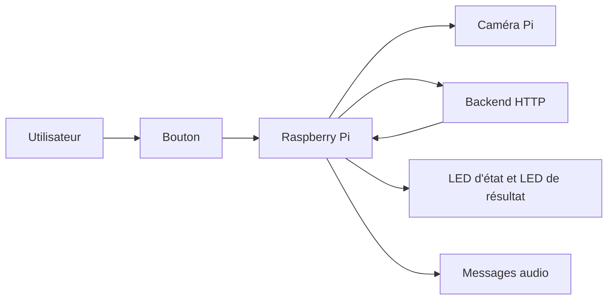

# Tricolo IoT

Système embarqué de tri des déchets basé sur Raspberry Pi, conçu pour guider l’utilisateur à l’aide d’un retour visuel et vocal après analyse d’une photo envoyée à un backend distant.

## Vue d’ensemble

Tricolo IoT pilote une station de tri interactive. Lorsqu’un utilisateur appuie sur un bouton physique, le Raspberry Pi capture une image du déchet, l’envoie à une API distante pour classification, puis restitue le résultat via :

- une LED d’état,
- une LED de résultat,
- un message audio préenregistré.

Le projet couvre principalement la logique embarquée côté Raspberry Pi ainsi que les utilitaires permettant de générer et lire les fichiers audio du système.

## Fonctionnement

1. Le système démarre et signale son état de disponibilité avec une animation LED bleue.
2. L’utilisateur appuie sur le bouton physique.
3. Le Raspberry Pi affiche un état d’attente, joue un message audio, puis capture une photo.
4. La photo est envoyée au backend distant après authentification.
5. Le backend retourne une catégorie de tri.
6. Le système :
   - allume la LED de résultat avec la couleur associée,
   - joue le message audio correspondant,
   - envoie une requête complémentaire au endpoint `/jeter/{categorie}`.
7. La photo temporaire est supprimée et le système se réinitialise automatiquement.

## Architecture applicative

### Composants principaux

- **`main.py`** : point d’entrée de l’application embarquée, orchestration du bouton, des LED, de la caméra, de l’authentification et des appels réseau.
- **`TTS_MainCode.py`** : utilitaire pour générer et tester les messages audio du projet.
- **`tts/generator.py`** : génération de fichiers MP3 à partir de texte via Edge TTS.
- **`tts/player.py`** : lecture locale des fichiers audio présents dans `audio/`.
- **`audio/`** : bibliothèque des messages vocaux utilisés par le système.

### Flux technique



## Matériel ciblé

Le code est conçu pour une exécution sur Raspberry Pi avec des composants matériels connectés :

- Raspberry Pi
- bouton poussoir
- 2 LED RGB
- caméra compatible `Picamera2`
- système audio capable de lire les fichiers MP3

## Dépendances et prérequis

### Logiciels

- Python 3
- Raspberry Pi OS ou distribution Linux compatible GPIO/caméra
- `mpg123` pour la lecture audio sous Linux

### Bibliothèques Python utilisées

Le dépôt fait actuellement référence aux bibliothèques suivantes :

- `gpiozero`
- `picamera2`
- `requests`
- `python-dotenv`
- `edge-tts` *(nécessaire uniquement pour régénérer les fichiers audio)*

## Configuration

La configuration est actuellement définie directement dans `main.py` :

- broches GPIO,
- URLs du backend,
- identifiants de connexion,
- répertoire temporaire des photos,
- correspondances couleurs/catégories,
- correspondances catégories/messages audio.

Avant un déploiement réel, il est recommandé d’adapter ces constantes à votre environnement matériel et réseau.

## Utilisation

### Lancer le système embarqué

```bash
python3 main.py
```

### Générer ou tester les fichiers audio

```bash
python3 TTS_MainCode.py
```

## Structure du dépôt

```text
Tricolo_IoT/
├── main.py
├── TTS_MainCode.py
├── README.md
├── LICENSE
├── audio/
│   ├── attente.mp3
│   ├── bac_plein.mp3
│   ├── compost.mp3
│   ├── dechets.mp3
│   ├── erreur_detection.mp3
│   ├── introduction.mp3
│   ├── merci.mp3
│   └── recyclage.mp3
└── tts/
    ├── __init__.py
    ├── generator.py
    └── player.py
```

## Comportement fonctionnel actuel

### Couleurs de retour

- **Vert** : recyclage
- **Orange** : compost
- **Violet** : poubelle / déchets ordinaires
- **Rouge** : erreur ou catégorie non reconnue

### Messages audio prévus

Le système gère notamment les messages suivants :

- introduction,
- attente,
- recyclage,
- compost,
- déchets,
- autre,
- bac plein,
- erreur de détection,
- remerciement.

## Limites connues

- La classification des déchets dépend entièrement d’un backend externe.
- La configuration n’est pas encore externalisée dans un fichier dédié.
- Le projet est centré sur le prototype embarqué ; il n’inclut pas le code du backend distant.
- Le fonctionnement complet nécessite l’accès au matériel Raspberry Pi concerné.

## Pistes d’amélioration

- externaliser la configuration dans un fichier ou des variables d’environnement,
- ajouter une stratégie de reprise réseau plus robuste,
- formaliser l’installation via un fichier de dépendances,
- ajouter des tests automatisés pour la logique applicative.

## Licence

Ce projet est distribué sous licence MIT. Voir [LICENSE](LICENSE).
